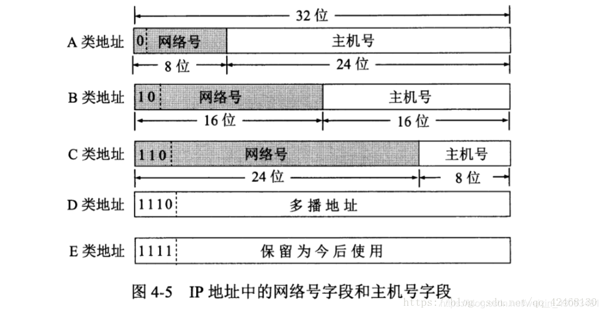

# CS-Professional-English1.4
[跳转至another.md看第五章](another.md)
## 计算机网络知识点总结-第四章：网络层
#### 本章知识图（网络图片）


#### 常用的三类IP地址：
1. **A类**：
>  + 最大可指派网络数：126(2^7-2)
>       - *8位除去1个固定位剩7位，减2因为要除去全0和全1位*
>  +  第一个可指派的网络号：1
>  + 最后一个可指派的网络号：126
>  + 每个网络中最大主机数：16777214(2^24-2（网络地址+广播地址）)
2. **B类**：
>  + 最大可指派网络数：16383(2^14-1) 
>       - *16位除去2个固定位，减1因为有两个固定位为10，所以不存在全0或全1，但规定128.0.0.0不使用，所以减去*
>  + 第一个可指派的网络号：128.1
>  + 最后一个可指派的网络号：191.255
>  + 每个网络中最大主机数：65534(2^16-2（网络地址+广播地址））
3. **C类：**
>  + 最大可指派网络数：2097151(2^21-1) 
>       - *24位除去3个固定位，减1同B类，192.0.0.0规定不使用*
>  + 第一个可指派的网络号：192.0.1
>  + 最后一个可指派的网络号：223.255.255
>  + 每个网络中最大主机数：254(2^8-2（网络地址+广播地址））
#### （本地图片）

***
 
#### IP地址的指派范围：
| 网络类别 | 最大可指派的网络数 | 第一个可指派的网络号 | 最后一个可指派的网络号 | 每个网络中的最大主机数 |
| :----: | :----: | :----: | :----: | :----: |
| A | 126(2<sup>7</sup>-2) | 1 | 126 | 16777214 |
| B | 16383(2<sup>14</sup>-1) | 128.1 | 191.255 | 65534 |
| C | 2097151(2<sup>21</sup>-1) | 192.0.1 | 223.255.255 | 254 |

***
#### ~~一般不使用的特殊IP地址：~~
| 网络号 | 主机号 | 源地址使用 | 目的地址使用 | 代表的意思 |
| :----: | :----: | :----: | :----: | :----: |
| 0 | 0 | 可以 | 不可 | 在本网络上的本主机 |
| 0 | host-id | 可以 | 不可 | 在本网络上的某台主机host-id |
| 全1 | 全1 | 不可 | 可以 | 只在本网络上进行广播 |
| net-id | 全1 | 不可 | 可以 | 对net-id上的所有主机进行广播 |
| 127 | 非全0或全1的任何数 | 可以 | 可以 | 用于本地软件环回测试 |

***
#### 代码块 Syntax highlighting

    ```python
    #!/usr/bin/env python3
    print("Hello, World!");
    ```
	
***
内容转载于 [计算机网络知识点总结-第四章：网络层](https://blog.csdn.net/weixin_43093481/article/details/86684040)
